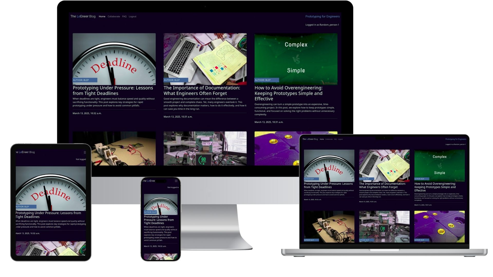
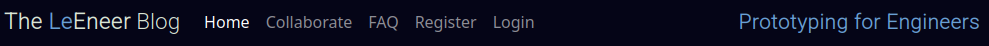
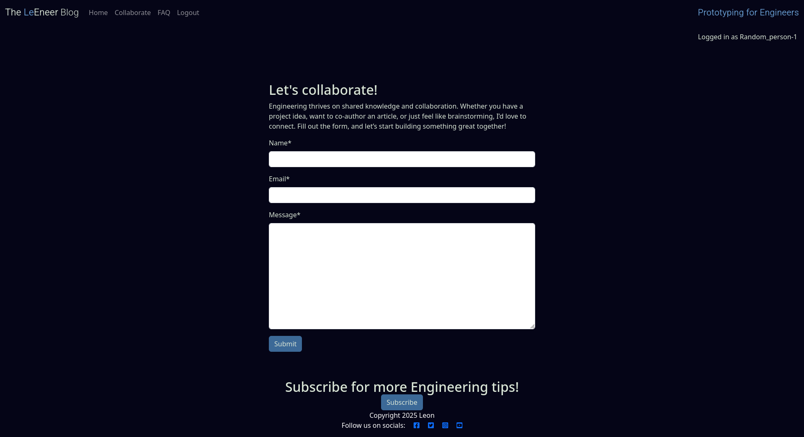

<div align="center">
  
</div>
<div align="center">
  
</div>

[Prototyping for Engineers](https://le-engineer-cb388e5b5656.herokuapp.com/) "Prototyping for Engineers" is an interactive blog designed to educate engineers, students, and enthusiasts on often-overlooked aspects of engineering and technology. The site prioritizes interactivity, allowing users to engage with content through discussions and comments. With a minimal, easy-to-read design featuring a dark background for eye comfort, the website ensures a distraction-free learning experience. While the content is still in development, AI-generated placeholders help structure the topics. The goal is to provide valuable insights that engineers might miss in their day-to-day work, making it a hub for continuous learning and discussion."
## Table of Contents
1. <details open>
    <summary><a href="#ux">UX</a></summary>

    <ul>
    <li><details>
    <summary><a href="#goals">Goals</a></summary>

    - [Visitor Goals](#visitor-goals)
    - [Business Goals](#business-goals)
    - [User Stories](#user-stories)
    </details></li>

    <li><details>
    <summary><a href="#visual-design">Visual Design</a></summary>

    - [Wireframes](#wireframes)
    - [Fonts](#fonts)
    - [Icons](#icons)
    - [Colors](#colors)
    - [Images](#images)
    - [Styling](#styling)
    </details></li>
    </ul>
</details>

2. <details open>
    <summary><a href="#features">Features</a></summary>

    <ul>
    <li><details>
    <summary><a href="#page-elements">Page Elements</a></summary>

    - [All Pages](#all-pages)
    - [Index Page](#index-page)
    - [Gallery Page](#gallery-page)
    - [Contact Page](#contact-page)
    </details></li>

    <li><details>
    <summary><a href="#feature-ideas">Feature Ideas</a></summary>

    - [Basic](#basic)
    - [Content](#content)
    </details></li>
    </ul>
</details>

3. <details open>
    <summary><a href="#technologies-used">Technologies Used</a></summary>

    - [Languages](#languages)
    - [Frameworks](#frameworks)
    - [Libraries](#libraries)
    - [APIs](#apis)
    - [Platforms](#platforms)
    - [Other Tools](#other-tools)
</details>

4. <details open>
    <summary><a href="#testing">Testing</a></summary>

    <ul>
    <li><details>
    <summary><a href="#methods">Methods</a></summary>

    - [Validation](#validation)
    - [General Testing](#general-testing)
    - [Mobile Testing](#mobile-testing)
    - [Desktop Testing](#desktop-testing)
    </details></li>

    <li><details>
    <summary><a href="#bugs">Bugs</a></summary>

    - [Known Bugs](#known-bugs)
    - [Fixed Bugs](#fixed-bugs)
    </details></li>
    </ul>
</details>

5. <details open>
    <summary><a href="#deployment">Deployment</a></summary>

    <ul>
    <li><details>
    <summary><a href="#local-deployment">Local Deployment</a></summary>

    - [Local Preparation](#local-preparation)
    - [Local Instructions](#local-instructions)
    </details></li>

    <li><details>
    <summary><a href="#github-deployment">GitHub Deployment</a></summary>

    - [GitHub Preparation](#github-preparation)
    - [GitHub Instructions](#github-instructions)
    </details></li>
    </ul>
</details>

6. <details open>
    <summary><a href="#credit-and-contact">Credit and Contact</a></summary>

    - [Content](#content)
    - [Contact](#contact)
</details>

## Table of Contents
1. <details open>
    <summary><a href="#ux">UX</a></summary>

    <ul>
    <li><details>
    <summary><a href="#goals">Goals</a></summary>

    - [Visitor Goals](#visitor-goals)
    - [Business Goals](#business-goals)
    - [User Stories](#user-stories)
    </details></li>

    <li><details>
    <summary><a href="#visual-design">Visual Design</a></summary>

    - [Wireframes](#wireframes)
    - [Fonts](#fonts)
    - [Icons](#icons)
    - [Colors](#colors)
    - [Images](#images)
    - [Styling](#styling)
    </details></li>
    </ul>
</details>

2. <details open>
    <summary><a href="#features">Features</a></summary>

    <ul>
    <li><details>
    <summary><a href="#page-elements">Page Elements</a></summary>

    - [All Pages](#all-pages)
    - [Index Page](#index-page)
    - [Gallery Page](#gallery-page)
    - [Contact Page](#contact-page)
    </details></li>

    <li><details>
    <summary><a href="#feature-ideas">Feature Ideas</a></summary>

    - [Basic](#basic)
    - [Content](#content)
    </details></li>
    </ul>
</details>

3. <details open>
    <summary><a href="#technologies-used">Technologies Used</a></summary>

    - [Languages](#languages)
    - [Frameworks](#frameworks)
    - [Libraries](#libraries)
    - [APIs](#apis)
    - [Platforms](#platforms)
    - [Other Tools](#other-tools)
</details>

4. <details open>
    <summary><a href="#testing">Testing</a></summary>

    <ul>
    <li><details>
    <summary><a href="#methods">Methods</a></summary>

    - [Validation](#validation)
    - [General Testing](#general-testing)
    - [Mobile Testing](#mobile-testing)
    - [Desktop Testing](#desktop-testing)
    </details></li>

    <li><details>
    <summary><a href="#bugs">Bugs</a></summary>

    - [Known Bugs](#known-bugs)
    - [Fixed Bugs](#fixed-bugs)
    </details></li>
    </ul>
</details>

5. <details open>
    <summary><a href="#deployment">Deployment</a></summary>

    <ul>
    <li><details>
    <summary><a href="#local-deployment">Local Deployment</a></summary>

    - [Local Preparation](#local-preparation)
    - [Local Instructions](#local-instructions)
    </details></li>

    <li><details>
    <summary><a href="#github-deployment">GitHub Deployment</a></summary>

    - [GitHub Preparation](#github-preparation)
    - [GitHub Instructions](#github-instructions)
    </details></li>
    </ul>
</details>

6. <details open>
    <summary><a href="#credit-and-contact">Credit and Contact</a></summary>

    - [Content](#content)
    - [Contact](#contact)
</details>


----

# UX  
## Goals  
### Visitor Goals  
The target audience for the **Le_Eneer engineering blog** are:  
- Engineers and developers seeking technical insights and tutorials.  
- Students and professionals looking to learn about engineering concepts.  
- Individuals interested in the latest trends and innovations in engineering.  
- Readers who want to engage with the blog's community and share ideas.  
- Potential collaborators or employers interested in the author's expertise.  

User goals are:  
- Read high-quality, informative blog posts on engineering topics.  
- Explore tutorials, case studies, and project walkthroughs.  
- Contact the author for collaboration or inquiries.  
- Stay updated with the latest posts through a newsletter or RSS feed.  
- Engage with the content through comments or social media.  

The Le_Eneer engineering blog fulfills these needs by:  
- Featuring a clean, intuitive design that prioritizes content readability.  
- Highlighting the blog posts and categories prominently on the homepage.  
- Including a contact form for inquiries and collaboration requests.  
- Offering social media links 
- Using a responsive design for seamless access on all devices.  
- Integrating a commenting system to encourage community engagement.  

### Business Goals  
The Business Goals of the Le_Eneer engineering blog are:  
- Establish the author as an authority in the engineering field.  
- Grow a loyal audience through engaging and valuable content.   
- Provide a platform for networking and collaboration opportunities.  
- Showcase the author's expertise to attract potential employers or clients.  

### User Stories  
1. As a user interested in engineering, I expect to find well-written, informative blog posts.  
2. I expect the blog to be easy to navigate, with clear categories and search functionality.  
3. As a student, I want to access tutorials and guides to learn new skills.  
4. As a professional, I expect to find insights into industry trends and innovations.  
5. As a potential collaborator, I want an easy way to contact the author.  
6. I want to engage with the content by leaving comments or sharing posts on social media.  
7. I expect the website to be mobile-friendly for on-the-go reading.   

## Visual Design
### Wireframes
The wireframes were done using [wirify](https://www.wirify.com/)
#### The home page
<div align="center">
  
</div>

#### A blog post
<div align="center">
  
</div>

### Fonts
<div align="center">
  
</div>

- The primary font, [Roboto](https://fonts.google.com/specimen/Roboto?query=roboto) was chosen because it is minimal, and easy to read while remaining refined. As a font, it gave me the impression of something utilitarian but comfortable. Being clear, clean and simple, maintaining the idea of a minimalist aesthetic. 
- The secondary font, [Times new Roman](https://learn.microsoft.com/en-us/typography/font-list/times-new-roman) was chosen because it is standard, plain and informative but not too rigid. It looks friendly and conversational but holds a seriousness. It is also serif, making it very easily readable throughout different color schemes and complementary to the font used for the blogs.
- Other fonts default to the system-ui CSS font family. This uses the default font of the user's operating system, providing a consistent and familiar appearance across different platforms.

### Icons
<div align="center">
  
</div>

- Icons are taken from the [Fontawesome](https://fontawesome.com/) Icon library.
- Icons are utilized in the footer for social account icons and for now only lead to the main social media website.

### Colors
<div align="center">
  
</div>

- I wanted the site to maintain a minimal and dark aesthetic, colors pop on the black background but remain, clean to highlight the content of the images and text.
- The primary color used is rich black, avoiding the designers bane of full black. This is used to create a comfortable viewing experience I have come to personally love. This not only helps to ease strain on the eyes but draw them directly from the logo to the content. This removes distraction, a common practice in theatre, cinemas, etc. White is often used in galleries but has more to do with lighting and reflection. On most computer screens, wherein the light is emitted from the screen, black is a better choice.
- Two accent colors were chosen, the blue to give a welcoming introduction and red to make the color contrast as well as make unmistakable the button highlights. These color choices are necessary to have an impact and lead the reader on this dark background.
- Text is primarily written in off-white to contrast on the dark color backgrounds of the primary and accent colors.

### Blogs
<div align="center">
  
</div>

- The site has a heavy focus on blogs, using full-size quality images to draw in th viewer.
- In the main gallery, blogs are displayed in three columns responsively, so they can easily be seen on any size device.
- Clicking on a blog will open up a full-page modal that displays the image alongside the blog content, in detail.
- The image and text will automatically space themselves vertically within the column, so the blog remains readable.

### Styling
<div align="center">
  
</div>
- For this project I have utilized Bootstrap 5.3 source files to override their class defaults to my liking, making customization much easier. The entire site can be restyled with a single switch in the code.
- Utilizing CSS, all images on the home page have rounded corners on the top, providing a comfortable entrance to the page, contrast to the harsh and often unappealing nature of sharp corners.
- As the site has a beeline focus on use, links on each page are re-used to direct the user to either the home page for other blogs or the collaboration page.
- Interactivity is paramount to any blog and as such, comments are spread and easily accessible to logged in users, providing a place to share thoughts and exchange opinions.

----
## Entity-Relationship Diagram (ERD)
### Database Schema Overview


The database created follows a Django-based structure with authentication, user management, and content tracking. Below are the key entities and their relationships complimenting the above generated ERD diagram.

1. **User Management:**
   - `auth_user`: Stores registered users with attributes like `username`, `email`, `password`, and role flags.
   - `auth_group`: Defines user groups or roles.
   - `auth_permission`: Manages permissions assigned to users or groups.
   - **Relationships:**
     - `auth_user_groups`: Links users to groups (many-to-many).
     - `auth_user_user_permissions`: Links users to permissions (many-to-many).
     - `auth_group_permissions`: Links groups to permissions (many-to-many).

2. **Content and Logging:**
   - `django_content_type`: Tracks Django model registrations.
   - `django_admin_log`: Logs administrative actions, linking to `auth_user` and `django_content_type`.

3. **Sessions and Migrations:**
   - `django_session`: Manages user sessions.
   - `django_migrations`: Tracks database schema changes.


# Features
## Page Elements
### All Pages
#### Navbar
<div align="center">
  
  
</div>

- The Navbar is simple but striking, providing 6 options aiming to provide multiple functionality to the user while still attempting to maintain the minimalist style.
- The Logo is highlighted with a small red accent to make it pop, swapping position as necessary depending on device size.
- On smaller devices, the menu becomes collapsible.
- The mobile nav button has been placed to the right for ease of use with one hand.

#### Footer
<div align="center">
  
  
</div>

- Located at the bottom of every page, The first thing you noticed is the subscribe call to action before highlighting social contacts and copyright with the blog owner.
- Made of one column with links centered, it changes shape for larger or smaller devices.


## Website Structure
### Index Page
<div align="center">
  
</div>

#### Blog Posts
- Displays the latest blog entries in a clean and structured format.
- Uses a minimalistic design with a dark background for readability and contrast.
- Interactive elements enhance user experience, such as hover effects on post titles.
- Blog posts include metadata such as the author and posting date.

### The Blog Content
<div align="center">
  
</div>

- Each blog post has a dedicated page displaying its full content.
- Comment sections allow for community interaction.
- Posts feature relevant images and embedded media to enhance readability.
- Navigation links make it easy to browse through multiple posts.

### Comments Section
- Users can leave comments on blog posts.
- A clean, responsive design ensures readability on different devices.
- Uses AJAX for smooth submission without needing to reload the page.
- Moderation features help maintain constructive discussions.
- Styled to match the website’s aesthetic while maintaining clarity.


#### Comment delete
### User Accounts
- Users can create an account to engage with the platform.
- Account creation allows interaction with blog posts, such as commenting.
- Secure authentication through oauth ensure user data protection.

### Login
- Users can log in using their credentials to access personalized features.
- Ensures session persistence, allowing users to stay logged in securely.

### Logout
- Provides a simple logout functionality to end the user's session securely.
- Redirects to the home page after logging out.

### Register
- New users can sign up with their email and password.
- Registration includes validation to prevent invalid inputs.
- Ensures only registered users can interact with content.


#### collaboration page
<div align="center">
  
</div>

- The collaboration page allows users to provide a message and their details to ask to collaborate with the website blog author.

### Subscription page
<div align="center">
  
</div>

- A simple page allowing users to enter their email and sign up to a newsletter

## Additional Features

### Admin page
- All data coming in and out of the website can be controlled here via CRUD.
- Comments from users may be validated and confirmed here.
- Newsletters and posts may be created.

## Feature Ideas
### Basic
- All links are placeholders for now, leading to the social page. For this blog to be fully function social pages would nee to be made and linked
- The ability to reply to individual comments to create a thread type discussion would be very good for interactivity
- Some kind of monetization in terms of newsletter content or behind the scenes.
- Generally the style if good, but could do with an actual designer.


----

# Technologies Used
## Languages
- [HTML](w3.org/standards/webdesign/htmlcss)
    * Page markup.
- [PYTHON](https://www.python.org/)
    * Page logic.
- [CSS](w3.org/standards/webdesign/htmlcss)
    * Styling.
- [Javascript](https://developer.mozilla.org/en-US/docs/Web/JavaScript)
    * Running functions for interactive components, AJAX, etc.

## Frameworks
- [Django](https://www.djangoproject.com/)
    * Used as a high-level Python framework, enabling rapid development.
- [Bootstrap](https://getbootstrap.com/)
    * Used for its easy nav-bar and button styling.

## Libraries
 Many Libraries were used, with the most prominent listed here. A full list of libraries can be found in requirements.txt

- [django-allauth](https://django-allauth.readthedocs.io/en/latest/)
    * Integrated set of Django applications addressing authentication, registration, account management, and third party (social) account authentication.
- [django-crispy-forms](https://django-crispy-forms.readthedocs.io/en/latest/)
    * A Django app that helps you manage Django forms in a more elegant way.
- [gunicorn](https://gunicorn.org/)
    * A Python WSGI HTTP Server for UNIX.
- [cloudinary](https://cloudinary.com/)
    * A cloud service that offers a solution to a web application's entire image management pipeline.
- [requests](https://docs.python-requests.org/en/latest/)
    * A simple, yet elegant HTTP library for Python.
- [cryptography](https://cryptography.io/en/latest/)
    * A package designed to expose cryptographic recipes and primitives to Python developers.
- [whitenoise](http://whitenoise.evans.io/en/stable/)
    * A middleware for serving static files in a Django application.

## APIs
- [Cloudinary API](https://cloudinary.com/documentation)
    * A cloud service that provides a comprehensive solution for image and video management, including uploading, transforming, and delivering media assets efficiently.

- [OAuth API](https://oauth.net/2/)
    * A protocol that allows third-party applications to securely access user data without sharing passwords, commonly used for social authentication in web applications.


## Platforms
- [Github](https://github.com/)
    * Storing code remotely and deployment.
- [CODE OSS](https://code.visualstudio.com/)
    * An open-source version of Visual Studio Code.
- [Heroku](https://www.heroku.com/)
    * A cloud platform that enables developers to build, run, and operate applications entirely in the cloud, simplifying deployment and scaling.
- [PostgreSQL](https://www.postgresql.org/)
    * An advanced, open-source relational database management system known for its robustness, extensibility, and support for complex queries.


## Other Tools
- [dbdiagram.io](https://dbdiagram.io)
    * A web-based tool for designing and visualizing database schemas.
- [Canva](https://www.canva.com/)
    * A graphic design platform, used to create mockups.
- [Coolors](https://coolors.co/)
    * Creating color pallettes.

## Apps
- [django-easy-faq](https://github.com/smark-1/django-easy-faq)
    * For the FAQ page Django app.

----

# Testing
## Methods
### Validation
- Testing files may be found in the source code and may be validated using "python3 manage.py test"  

- Performance was tested via [Pagespeed](https://pagespeed.web.dev/)
    Best Practices are lower due to HTTPS not being implemented. Otherwise the site passes perfectly.
    <div align="center">
        
    </div>

- HTML has been validated with [W3C HTML5 Validator](https://validator.w3.org/).
    - https://le-engineer-cb388e5b5656.herokuapp.com/ [All clear, no errors found]
    - https://le-engineer-cb388e5b5656.herokuapp.com/about/ [All clear, no errors found]
    - https://le-engineer-cb388e5b5656.herokuapp.com/faq/ [All clear, no errors found]
    - https://le-engineer-cb388e5b5656.herokuapp.com/accounts/logout/ [All clear, no errors found]

- CSS has been validated with [W3C CSS Validator](https://jigsaw.w3.org/css-validator/) and auto-prefixed with [CSS Autoprefixer](https://autoprefixer.github.io/).
    - static/css/styles.css [All clear, no errors found]

- Links checked with [W3C Link Checker](https://validator.w3.org/checklink).
    - https://le-engineer-cb388e5b5656.herokuapp.com/ [No broken links]

- Each javascript file was tested on the site for errors and functionality using the console and with [JSHint](https://jshint.com/).
    - static/js/comments-js [No errors found]

- Python Linter
    - about/admin.py [All clear, no errors found]
    - about/urls.py [All clear, no errors found]
    - about/models.py [All clear, no errors found]
    - about/forms.py [All clear, no errors found]
    - about/views.py [All clear, no errors found]
    - about/apps.py [All clear, no errors found]

    - blog/urls.py [All clear, no errors found]
    - blog/views.py [All clear, no errors found]
    - blog/models.py [All clear, no errors found]
    - blog/admin.py [All clear, no errors found]
    - blog/apps.py [All clear, no errors found]
    - blog/forms.py [All clear, no errors found]

    - le_engineer/urls [All clear, no errors found]
    - le_engineer/settings.py [All clear, Line-too-long errors ignored.]

    - manage.py [All clear, no errors found]

    - Additionally, throughout development many python print statements were used to validate code. these have been removed.

### General Testing
- Each feature was developed and tested in its own branch before being merged with master. Branches were subsequently deleted.
- Each time a feature was added, all the functions were tested to see if there was an impact.
- The site was sent to friends for feedback and testing, this also allowed for different operating systems and browser testing.
- All forms have validation and will not submit without the proper information.
- .gitignore file has been included to prevent system file commits as well as hide any sensitive information and reduce the ease of malicious attacks.
- Image upload functions have been tested with different formats and sizes.
- External links open in a new tab. Also being tested on multiple devices on multiple browsers.
- Attempts at accessing the admin page have tested; when altering the url.
- Attempts attempts at altering other users comments through url manipulation are not possible.

### Mobile Testing
- I tested the site personally on my Android device, going through every function; checking buttons, forms, logging in/out, etc. I was personally unable to test on iOS.
- The site was sent to friends and relatives for them to follow the same process. They have tested on their devices, including iOS.
- Duckduckgo was utilized to inspect the site in mobile format, going through the pages and functions.

### Desktop Testing
- The site was developed on a Thinkpad and the majority of testing occurred through Firefox.
- The site was tested by friends and relatives on numerous desktop devices.
- The site was marginally tested on other browsers, such as Firefox and Chrome.
- Internet Explorer was not tested and the site was not developed with it in mind as support for the browser is gradually being dropped.

## Bugs
### Known Bugs
- Currently not fully set up for newsletters. This would require an email setup.

### Fixed Bugs
- contrast on dark background was not high enough for accessability and was changed to a bright text on darker background
- Comments were not accessible from the admin page, fixed by connecting the comments via adding to the urls
- Delete comment confirmation was not visible. Fixed by adding text-black to the content.
- The subscribe button was throwing errors and breaking the entire website when a link was added. This was fixed by removing the 'a' tag and replacing it with a form and an action= instead of an href. 
- Many more bugs were fixed but non as largely breaking as the ones above.

----
# Deployment
## Local Deployment
### Local Preparation
**Requirements:**
- An IDE of your choice, such as [Visual Studio Code](https://code.visualstudio.com/)
- [Git](https://git-scm.com/)
- [Python](https://www.python.org/downloads/) installed on your system

### Local Instructions
1. Download a copy of the project repository [here](https://github.com/TheBlep/Le_Engineer_Blog) and extract the zip file to your base folder. Or you can clone the repository with:
    ```sh
    git clone https://github.com/TheBlep/Le_Engineer_Blog.git
    ```
    To disconnect it from the original repository, use:
    ```sh
    git remote rm origin
    ```
2. Open your IDE and choose the base directory.

3. Set up a virtual environment in VS Code:
    - Open a terminal in VS Code.
    - Run the following command to create a virtual environment:
      ```sh
      python3 -m venv .venv
      ```
    - Activate the virtual environment:
      - On Windows (PowerShell):
        ```sh
        .venv\Scripts\Activate
        ```
      - On macOS/Linux:
        ```sh
        source .venv/bin/activate
        ```
    - Install dependencies from `requirements.txt`:
      ```sh
      pip install -r requirements.txt
      ```

4. Run the project with your chosen method. If you have Python installed, you can run it using an HTTP server with the following command:
    ```sh
    python3 manage.py runserver
    ```
5. Open your web browser and navigate to `http://127.0.0.1:8000/` to access the site.
6. Enjoy!

## Online via Heroku
You can view the active site via the following Herkou link [here](https://le-engineer-cb388e5b5656.herokuapp.com/)


## Credits and Contact
### Content
Nearly all text content was generated by the AI, GPT-4.
All images are not mine and were downloaded from google.
Any code utilized from a site is documented and credited within the code.
All photographs, authors, license rights, copyright, etc. used in this project are for educational use only and no claim is made.

### Contact
Please feel free to contact me over github
